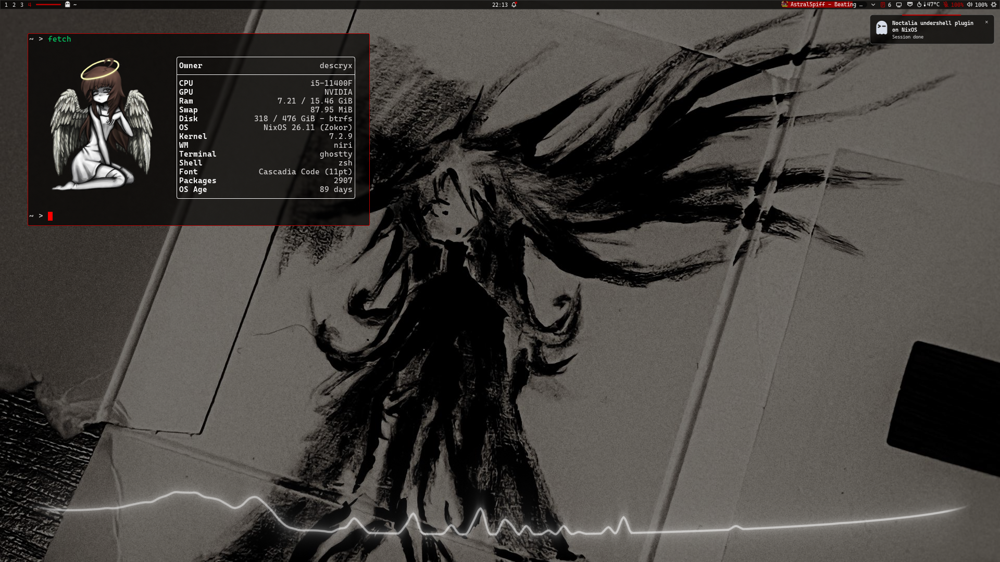
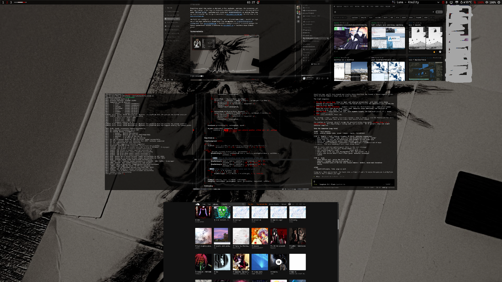
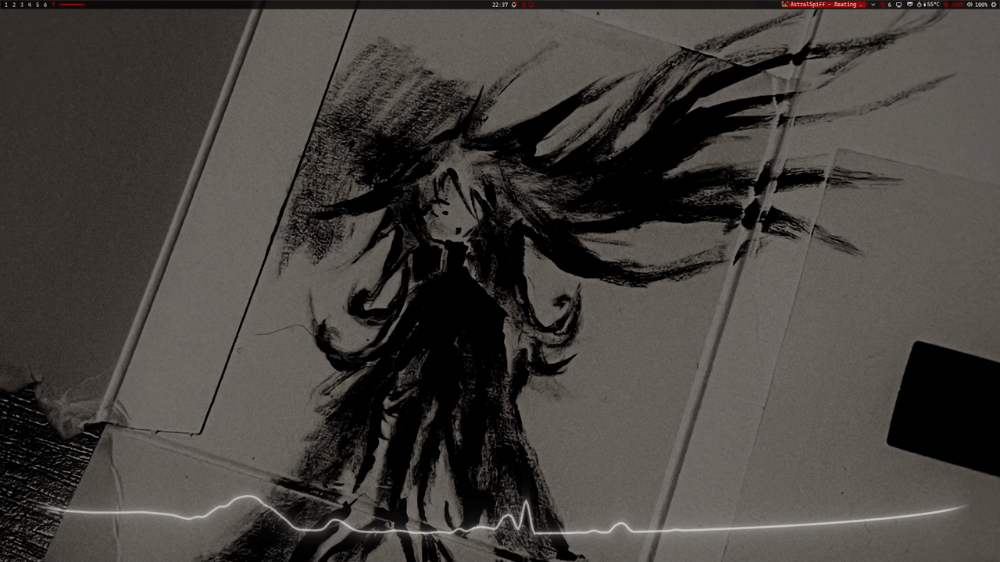

# nix-config

My personal, flake-based [NixOS](https://nixos.org) + [home-manager](https://github.com/nix-community/home-manager)
config for two machines. Inputs are pinned in `flake.lock`; dotfiles are
symlinked out of the store so they stay editable.

  
More screenshots

   
  

    
    
  

## Start here

Pick the path that matches what you want.

**If you just want the dotfiles.**
Every feature that ships config keeps it in `modules/<name>/config/`. The path
after `config/` usually mirrors where the files go: `modules/<name>/config/<app>/`
ends up in `~/.config/<app>/`. A few single-app features link `config/` straight
to the app directory instead, so if you're unsure, the feature's `home.nix` has
the exact `home.file` target. Browse `modules/*/config/` and copy what you need.
Two things to know: most of it assumes [Niri](https://github.com/YaLTeR/niri)
plus [Noctalia](https://github.com/noctalia-dev/noctalia), and several files
hardcode `/home/descryx` paths. `noctalia-config.toml` is generated, so set that
one up in Noctalia rather than copying it.

**If you want one piece of the config.**
Each folder under `modules/` is one app or concern and can hold `system.nix`
(NixOS), `home.nix` (home-manager) and `config/` (dotfiles). Copy the folder and
import the file(s) you need.

**If you want the whole config.**
Set your values in [`local.nix`](local.nix) also change coresponding files
like hardware-configuraton.nix, then rebuild. See
[Using this config](#using-this-config). To set up a new machine, follow the
tutors in [docs/NOTES.md](docs/NOTES.md).

**Just looking.**
Screenshots above; the full file tree is in [docs/structure.md](docs/structure.md).

## What's in here

| Device | Hostname | Hardware | Config |
|--------|----------|----------|--------|
| Desktop | `desk` | NVIDIA + Intel | [`hosts/desk/`](hosts/desk/) |
| Laptop  | `t480` | ThinkPad T480 (Intel) | [`hosts/t480/`](hosts/t480/) |

Most things are declared in Nix: packages, services, the compositor, and most app
configs. A few large or frequently edited configs stay as plain dotfiles in
`modules/<name>/config/`, symlinked with `mkOutOfStoreSymlink` so editing them
doesn't need a rebuild. How it all fits together is in
[docs/ARCHITECTURE.md](docs/ARCHITECTURE.md); again, the file tree is in
[docs/structure.md](docs/structure.md).

Main pieces:

- Desktop: [Niri](https://github.com/YaLTeR/niri) with
  [Noctalia](https://github.com/noctalia-dev/noctalia) as the shell.
- CLI: [zsh](https://www.zsh.org), [Ghostty](https://github.com/ghostty-org/ghostty),
  [Yazi](https://github.com/sxyazi/yazi), [Neovim](https://github.com/neovim/neovim)
  (LazyVim base with a custom colorscheme).
- Apps: [Zen Browser](https://github.com/zen-browser/desktop),
  [Obsidian](https://obsidian.md), [Vesktop](https://github.com/Vencord/Vesktop),
  GIMP, LibreOffice.
- Services: [Syncthing](https://syncthing.net) (syncs `Pictures` between the
  hosts), [EasyEffects](https://github.com/wwmm/easyeffects),
  [undershell](https://github.com/EternalSelf-2328/undershell) widgets, and an
  optional local Minecraft server.
- Dev: C++ toolchain (gcc/clang), [opencode](https://opencode.ai), and
  [git-hooks.nix](https://github.com/cachix/git-hooks.nix) pre-commit checks.

## Using this config

Prerequisites: NixOS unstable with flakes enabled, plus
[direnv](https://direnv.net) and nix-direnv for the dev shell.

Change these for your own setup:

| What | Where |
|---|---|
| Username / paths | [`local.nix`](local.nix) |
| Timezone | [`modules/system/users.nix`](modules/system/users.nix) |
| Boot / Plymouth | [`modules/system/boot.nix`](modules/system/boot.nix) |
| Minecraft UUIDs / MOTD | [`modules/optional/minecraft/system.nix`](modules/optional/minecraft/system.nix) |
| Noctalia | [`modules/noctalia/config/noctalia/noctalia-config.toml`](modules/noctalia/config/noctalia/noctalia-config.toml) |

To use it on your own hardware, drop `hosts/desk/` and `hosts/t480/`, add your
host (copy `hosts/_template/`), then rebuild with `nh os switch`. The new-machine
flow is untested, so read the tutors in [docs/NOTES.md](docs/NOTES.md) before you
trust it.

Secrets stay out of the repo: `local.nix` holds only your username, paths and
noreply git email; Noctalia plugin keys live per machine in
`~/.local/state/noctalia/settings.toml`; Syncthing pairs at runtime. There is no
secrets manager yet, just the checks in [docs/COMMANDS.md](docs/COMMANDS.md) and
the plan in [docs/NOTES.md](docs/NOTES.md).

## Development

`.envrc` loads the dev shell through direnv, which installs the pre-commit hooks
(nixfmt, deadnix, statix, check-toml, detect-private-keys, noctalia-scrub,
ripsecrets).

- `nix flake check` evaluates both hosts and builds the pre-commit check. It does
  not build the systems.
- `nix fmt` formats Nix files (treefmt: nixfmt + deadnix).
- `nix develop -c pre-commit run --all-files` runs every hook by hand.

More commands in [docs/COMMANDS.md](docs/COMMANDS.md).

## AI assistance & scope

Parts of this were written with an AI assistant ([opencode](https://opencode.ai)).
AI is mostly used for learning purposes of tedious refactoring,
i am relatively new to Nix and NixOS (~ since start of july).
It is a personal project tuned to specific hardware and shared as is: no warranty,
and you will need to adapt it.

## Credits

Full credits, third-party notices and licenses are in
[docs/CREDITS.md](docs/CREDITS.md). This config builds on
[Niri](https://github.com/YaLTeR/niri) and
[Noctalia](https://github.com/noctalia-dev/noctalia) and bundles a few third-party
configs.

## License

MIT, see [`LICENSE`](LICENSE). This covers the Nix configuration only; bundled
third-party configs and assets keep their own licenses (see
[docs/CREDITS.md](docs/CREDITS.md)).
